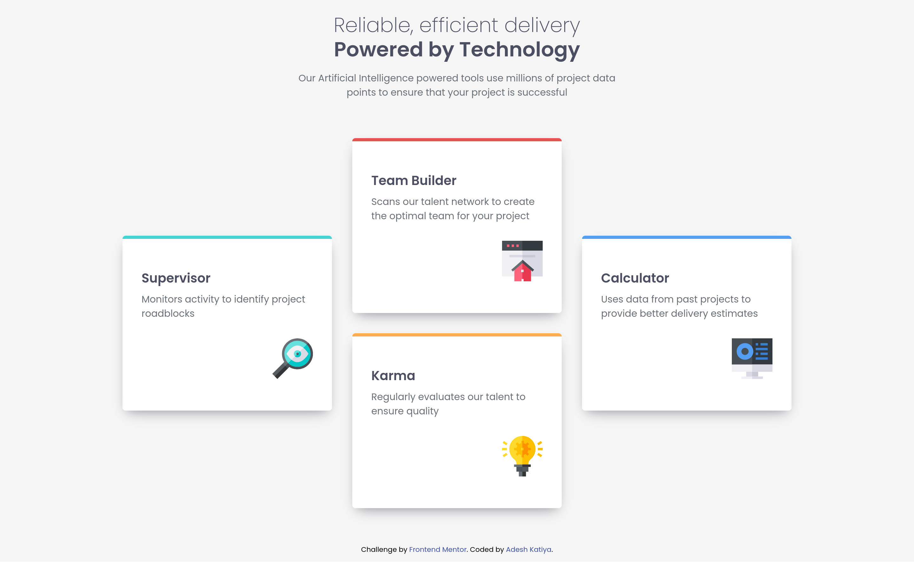

# Frontend Mentor - Four card feature section solution

This is a solution to the [Four card feature section challenge on Frontend Mentor](https://www.frontendmentor.io/challenges/four-card-feature-section-weK1eFYK). Frontend Mentor challenges help you improve your coding skills by building realistic projects.

## Table of contents

- [Overview](#overview)
  - [The challenge](#the-challenge)
  - [Screenshot](#screenshot)
  - [Links](#links)
- [My process](#my-process)
  - [Built with](#built-with)
  - [What I learned](#what-i-learned)
  - [Continued development](#continued-development)
  - [Useful resources](#useful-resources)

**Note: Delete this note and update the table of contents based on what sections you keep.**

## Overview

### The challenge

Users should be able to:

- View the optimal layout for the site depending on their device's screen size

### Screenshot

### Links

- Solution URL: [Four Card Feature Section](https://www.frontendmentor.io/solutions/responsive-four-card-feature-section-using-bem-syntax-and-sass-hTd4mkUct_)
- Live Site URL: [Four Card Feature Section](https://four-card-feature-section-master-liard-tau.vercel.app/)

## My process

### Built with

- Semantic HTML5 markup
- CSS custom properties
- Flexbox
- CSS Grid
- Mobile-first workflow
- SASS

### What I learned

- Learned a lot about styling grid layouts.
- Using grids in media queries.

### Continued development

- Probably want to learn more about the best practices used for layout development.
- Get more familiar with grid rules and properties and how to modify them according to different screen sizes.

### Useful resources

- [CSS Tricks Grid Layout Guide](https://css-tricks.com/snippets/css/complete-guide-grid/) - Helped me understand how grids work.
